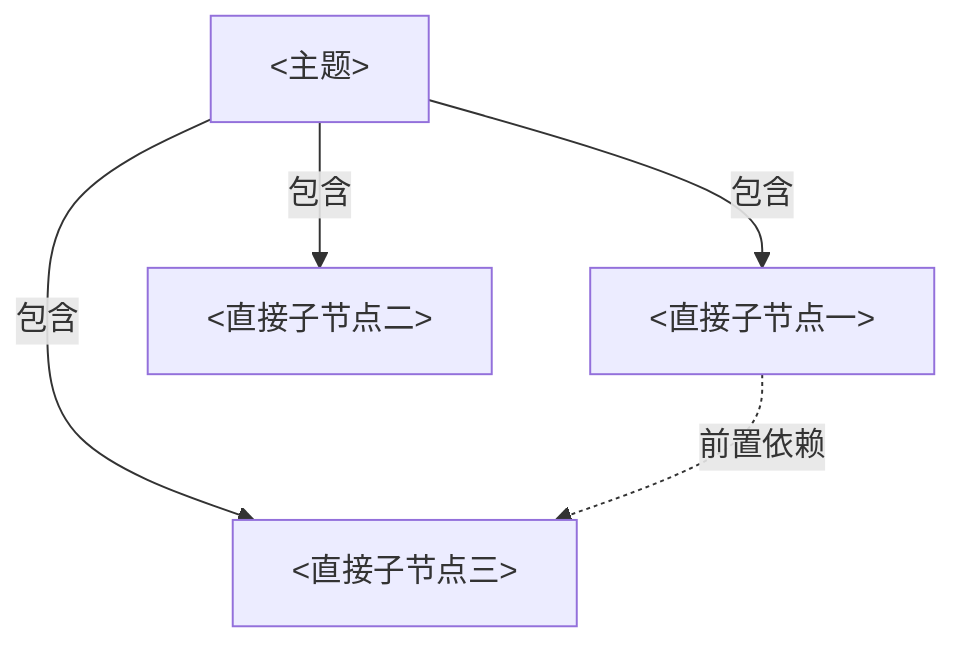
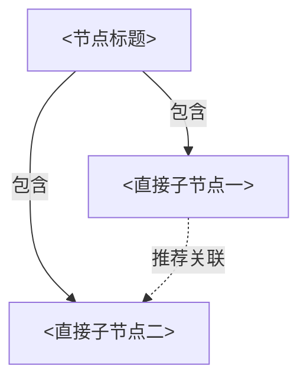

# 拆分式 Mermaid 知识地图格式

仅当用户明确要求保存或维护地图，并确认目标工作区时，创建 `knowledge-map-<topic-slug>/`。主题别名使用全小写和短横线。运行时生成的地图文件必须全部位于这个目录中。

```text
knowledge-map-<topic-slug>/
├── README.md               # 地图入口和根图
├── maps/                   # 已展开节点的 Mermaid 子图
│   └── <node-id>.md
└── sources.md              # 仅在需要来源索引时创建
```

目录只负责保存地图片段，不能用目录层级代替地图本身。知识结构必须由 Mermaid 图表达。所有子图平铺在 `maps/` 中，通过稳定节点 ID 和 Markdown 链接递归导航，不为每个节点创建嵌套目录。

这不是个人学习工作区。不要在其中保存课程、练习、学习记录、掌握状态或项目代码。

## 拆图规则

每张 Mermaid 图只有一个焦点节点，并且只展示它的直接子节点。不要在同一张图中继续画孙节点或更深层级。

只有用户选择某个节点展开，或明确要求连续展开某条分支时，才为该节点创建 `maps/<node-id>.md`。父图在 Mermaid 中保留该节点，并在图下的“已展开子图”列表链接到它的文件。子图再按相同规则展示下一层，由此递归形成完整地图。

用户要求“展开到最底层”时，仍然保持一层一图。沿指定分支连续创建各层子图，直到叶节点达到当前地图范围内的最小结构单元。不要把整条分支合并成一张巨图，也不要为未选择的兄弟分支预先创建文件。

## 节点与连线

- 为每个节点分配在整张知识地图中唯一且稳定的 ID。Mermaid ID 仅使用字母、数字和下划线，显示标题放在方括号中。
- 使用实线箭头和 `包含` 表达当前节点到直接子节点的层级关系。
- 使用虚线箭头表达 `前置依赖`、`推荐关联` 和 `应用分支`。仅绘制有助于理解当前层的跨节点关系。
- 标题修改时保留节点 ID。节点移动到其他父节点时也保留 ID，并修正相关链接。
- 图下必须提供普通 Markdown 链接来连接已创建的父图和子图，不依赖 Mermaid 的交互式点击功能。

## README.md

`README.md` 保存地图边界、根图以及已创建的第一层子图入口。

````md
# <主题> 知识地图

## 范围

- 包含：<本地图覆盖的子领域>
- 不包含：<明确排除的相邻领域>

## 根图



## 节点说明

- `N01 <直接子节点一>`：<它在当前领域中的作用>
- `N02 <直接子节点二>`：<它在当前领域中的作用>
- `N03 <直接子节点三>`：<它在当前领域中的作用>

## 已展开子图

- [N01 <直接子节点一>](./maps/N01.md)
````

若没有任何节点已展开，保留“已展开子图”标题并注明“暂无”，不要创建空的子图文件。

## 子图文件

`maps/<node-id>.md` 以被展开的节点为焦点，只展示它的直接子节点。父级入口指向包含该节点的图，而不是假设父级一定是根图。

````md
# N01 <节点标题>

父图：[返回包含此节点的图](../README.md)

## 子图



## 节点说明

- `N01_01 <直接子节点一>`：<简短作用>
- `N01_02 <直接子节点二>`：<简短作用>

## 已展开子图

- [N01_01 <直接子节点一>](./N01_01.md)
````

当父图也位于 `maps/` 时，父级链接使用同目录相对路径，例如 `./N01.md`。更新已有地图时，同步维护父图和子图两侧的导航链接，但不要清空或重建兼容内容。

## sources.md

仅在地图的版本、生态或争议性判断需要依据时创建。记录来源链接、来源性质和它支撑的地图判断，不复制外部全文，也不把它写成阅读清单。

```md
# <主题> 地图来源

- [官方文档标题](https://example.com)：官方文档。用于确认 <具体节点或关系>。
```
