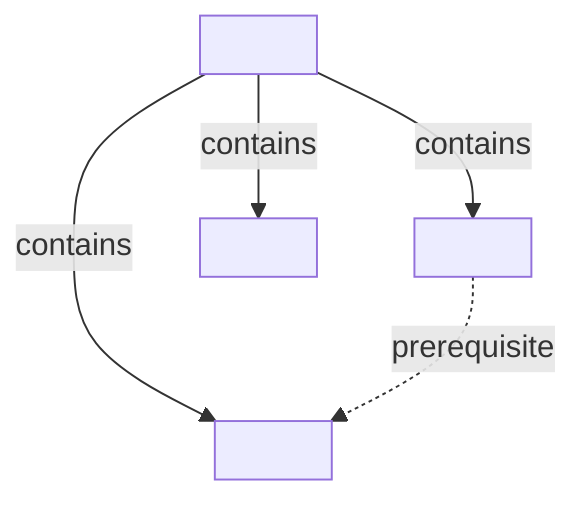
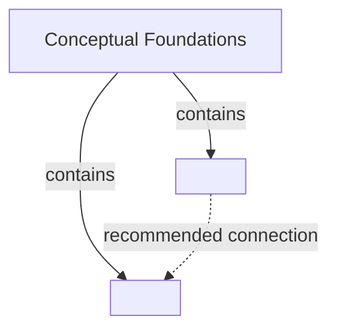
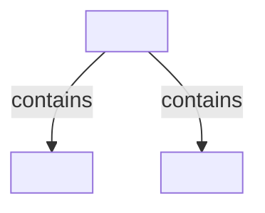

# Split Mermaid Knowledge Map Format

Create or maintain `knowledge-map-<topic-slug>/` by default after the topic and scope are confirmed. Use the current writable workspace unless the user names another location. Use lowercase words separated by hyphens for the topic slug. Every generated map artifact stays inside this directory. Skip file creation only when the user explicitly requests a preview or conversation-only map.

```text
knowledge-map-<topic-slug>/
├── README.md               # Map entry point and root diagram
├── maps/                   # Subsystem pages containing related local diagrams
│   └── <subsystem-name>.md
└── sources.md              # Provenance for consulted source material
```

The directory stores map pages but does not represent the knowledge structure itself. Mermaid diagrams represent that structure. Keep all map pages flat inside `maps/`, and navigate recursively through stable node IDs, Markdown headings, and links. Do not create a file or directory for every node.

This is not a personal learning workspace. Keep courses, exercises, study records, mastery status, and project code elsewhere.

## Source material is evidence

Source files and publications support the map but do not define its hierarchy. Extract and normalize knowledge from their contents before naming nodes. Record file names, book titles, chapter or section locations, and URLs in `sources.md` or node citations rather than drawing them as nodes.

Do not reproduce a source's directory tree, table of contents, or chapter sequence in Mermaid unless the user explicitly requests a source-aligned map. A heading may become a node only when it independently names a domain concept, mechanism, or operation. Do not copy reference files into the knowledge-map directory.

## Splitting rules

Each Mermaid diagram has one focus node and shows only its direct children. Put grandchildren and deeper descendants in another small diagram. That diagram may be another section in the same Markdown file.

Use two separate levels of splitting:

- **Diagram split:** Start another Mermaid diagram when expanding a child. Keep each diagram to one focus node and its direct children.
- **Page split:** Start another Markdown file only at the boundary of a coherent knowledge subsystem, not merely because another node was expanded.

When an expanded node belongs to the same subsystem as its parent, add a new heading and diagram to the existing subsystem page. Link to that heading with an anchor. A candidate branch may become `maps/<subsystem-name>.md` only when all of the following hold:

- It has a coherent purpose and a boundary that can be stated independently.
- Its internal relationships are stronger or more numerous than its relationships to surrounding branches.
- The parent page can retain enough context to explain where the subsystem belongs.
- Cross-page links can preserve every important external relationship without hiding context needed to understand the subsystem.

Eight Mermaid diagrams or about 50 visible nodes in one page is a complexity signal, not a page budget or split requirement. When a page reaches that scale, first improve its table of contents, section summaries, anchors, and local navigation. Split it only if the semantic-boundary test above also passes. If no natural boundary exists, keep the subsystem together even when the page is large. Systemic coherence takes priority over file size and visual symmetry.

When the user asks to expand to the deepest useful level, still keep one layer per diagram. Add successive diagrams along the requested branch until each leaf is the smallest structural unit useful within the current scope. Keep related diagrams in the same subsystem page unless the semantic-boundary test passes. Do not precreate pages or diagrams for unselected sibling branches.

## Nodes and edges

- Assign every node an ID that is unique and stable across the complete map. Mermaid IDs use only letters, digits, and underscores. Put the display title in brackets.
- Use solid arrows labeled `contains` for hierarchy from the focus node to its direct children.
- Use dotted arrows for `prerequisite`, `recommended connection`, and `application branch`. Draw only the cross-node relationships needed to understand the current layer.
- Preserve a node ID when its title changes. Also preserve it when the node moves under another parent, then repair the affected links.
- Give each expanded view an invisible HTML anchor derived from its stable ID. Provide ordinary Markdown links below each diagram to connect parent and child views. Use the invisible anchor for views in the same file and file-plus-anchor links for views in another page. Do not depend on Mermaid click interactions.
- Show only meaningful concept titles in rendered prose. Keep IDs out of headings, link labels, node-note labels, tables of contents, and other learner-facing text unless the user explicitly requests an identifier-oriented or debugging view.
- Keep provenance out of the graph structure. Put compact source references in node notes and full source details in `sources.md`.

## Page names

Name a map page after the complete subsystem represented by that file. Convert the human-readable subsystem name to lowercase kebab case, such as `agent-engineering.md`, `context-management.md`, or `evaluation-and-observability.md`.

Keep node identity and file naming separate:

- Stable IDs such as `AGT_ENG` belong inside Mermaid source, provenance fields, and invisible anchors.
- Filenames describe the subsystem in words and must not consist only of an internal ID or shortened code.
- Prefer the full domain term over an abbreviation, such as `large-language-models.md` instead of `llm.md`. Retain an abbreviation only when it is the subsystem's established name and expanding it would make recognition worse.
- Resolve filename collisions with a meaningful domain qualifier, not a numeric suffix or node ID.
- A minor wording improvement to a node title does not require renaming its page. Rename a page when its current name no longer describes the subsystem, then repair every incoming and outgoing link.

## README.md

`README.md` stores the map boundary, the root diagram, and links to any first-layer module pages that already exist.

````md
# <Topic> Knowledge Map

## Map Brief

- Learning goal: <what understanding, decision, or capability this map supports>
- Perspective: <lens shaping the map>
- Initial depth: <expected detail and stopping point>
- Includes: <subdomains covered by this map>
- Excludes: <adjacent areas explicitly outside the map>

## Root Diagram



## Node Notes

- **Conceptual Foundations:** <its role in the current domain>
- **Direct Child Two:** <its role in the current domain>
- **Direct Child Three:** <its role in the current domain>

## Expanded Views

- [Conceptual Foundations](./maps/conceptual-foundations.md#node-N01)
````

When no node has been expanded, keep the `Expanded Views` heading and write `None yet`. Do not create empty module pages.

## Subsystem pages

`maps/<subsystem-name>.md` groups related local views for one coherent subsystem. Each section focuses on one expanded node and shows only its direct children. A page may therefore contain several small Mermaid diagrams without merging them into one large graph.

````md
# Conceptual Foundations

Parent map: [Return to the root diagram](../README.md)

<a id="node-N01"></a>

## Conceptual Foundations



### Node Notes

- **Direct Child One:** <short role description>
- **Direct Child Two:** <short role description>

### Expanded Views

- [Direct Child One](#node-N01_01)

<a id="node-N01_01"></a>

## Direct Child One



### Node Notes

- **Grandchild One:** <short role description>
- **Grandchild Two:** <short role description>
````

Name a subsystem page after its subsystem, independently of the stable ID of its root node. If a large page contains a descendant branch that passes the semantic-boundary test, move that complete branch into a semantically named subsystem page and link to its invisible stable anchor, such as `./planning-and-reasoning.md#node-AGT_PLAN`. Keep the visible link text as the concept title. When updating an existing map, maintain navigation links on both parent and child views without clearing or rebuilding compatible content.

If an existing map uses one file per expanded node, preserve it during ordinary expansion. When the user asks to reduce fragmentation, consolidate related views into subsystem pages with readable names, verify all replacement links, and ask before deleting the superseded files.

When updating an existing page that exposes IDs in headings, navigation labels, or node notes, keep the IDs in Mermaid and invisible anchors while rewriting the visible text as concept titles. Repair affected links as part of the same update.

## sources.md

Create this file whenever local files, user-provided material, or external publications influence the map. Record a stable source ID, its path or URL, its type, the nodes or relationships it supports, and useful chapter, page, or section locations. These locations are provenance, not map nodes. Do not copy full external text or turn this file into a reading list.

```md
# <Topic> Map Sources

- `S01` [Source title](<path-or-url>): <source type>. Supports <node IDs or relationships>. Relevant locations: <chapters, pages, or sections>.
```
